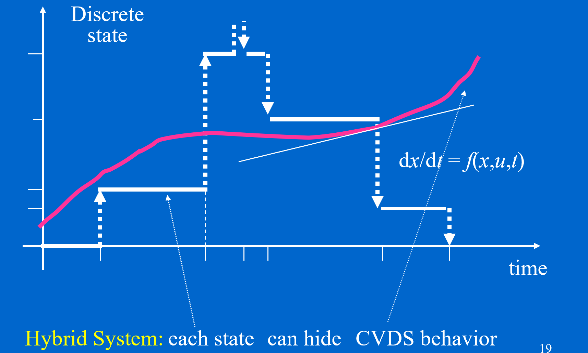
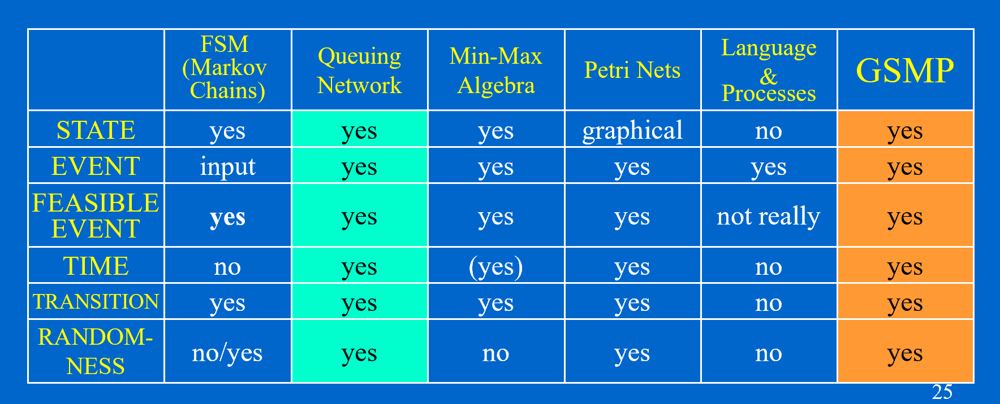

# Intro to Complex Systems

## Course Content

## Intro to DECS

1. What is Complex System:

   - simulation-based
   - takes long time to simulate

2. Time cost of simulation

   - a computer network, an electronic grid ...
   - several days --> optimize

3. What can we do?

   - **Model** the DEDS
   - **Simulate** the DEDS
   - **Evaluate** the DEDS
   - **Optimize** the DEDS

4. What is DEDS:

   - Discrete event dynamic system

   - state $s_{i}$ is concrete

   - state transition mechanism is **event-driven**

     e.g. Airport, The Internet

5. Nature of DEDS: 

   - A set of tasks
   - A set of resources
   - Routing (among resources)
   - Scheduing (among tasks)

   > Just like an optimization problem......

6. Comparison with a CVDS Trajectory:

   - $y$ axis --> event --> no value

     > Q: If we integrate the DEDS trajectory several times, we shall also get a smooth trajectory. What is wrong with this? 
     >
     > A: Because there are no metric assigned on the state space of a DEDS. **Integration of the DEDS trajectory makes no sense**, because the units of verticals axes has no meaning only graphical.

   - 

7. Modeling Ingredients:

   - Discrete State:

     combinatorial explosion 

   - Stochastic Effects

   - Hierarchical:

     depending on what level is needed to optimize the performance of interest

   - Computational

     computationally feasible algorithms 

8. Mathematical Specification:

   - state approach

     - $X$: finite state space
     - $A$: event space, e.g. arrival
     - $\Gamma(x)$: enabled event space
     - $f$: state transition function

   -  input / output approach:

     - string & language

   - clock mechanism:

     - $c_{n}(\alpha)$: the n-th lifetime of event $\alpha$
     - $\tau_{n}(\alpha)$: the time of the n-th occurrence of event $\alpha$

   - Different Models:

     

9. The workflow:

   - building models
   - validation and analysis
   - **evaluating the model**
   - **optimization and tuning**

10. Performance Evaluation:

   - sensitivity analysis: $J(\theta+\Delta \theta)$
   - performance surface: $J(\theta)$ at $\theta^{(i)}$
   - find optimal parameter $\theta_{optimal}(t)$

11. Three Approaches to a Simple Control Problem:

    - open loop control
    - feedback control
    - stochastic control