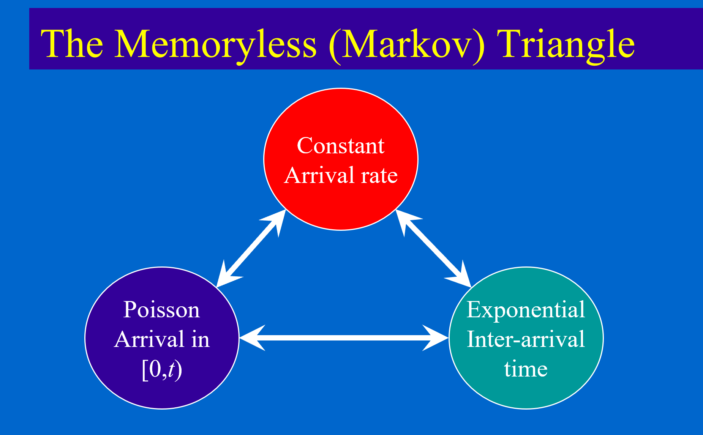

# Probability Fundamentals

## Memoryless Triangle

> 3 Properties below indicates that arrivals are **independent** and the stochastic process is **memoryless**.

1. Exponential Inter-arrival time:
   $$
   P(T\leq t+t_{0}|T>t_{0}) = 1 - e^{-\lambda t} = P(T \leq t) \Rightarrow p(t) = \lambda e^{-\lambda t}
   $$
   Inter-arrival time distribution of the customers is exponential.

2. Constant arrival rate:
   $$
   \begin{aligned}
   P(\Delta t) &= \lambda \Delta t  + o( \Delta t ) \\
   P(T \geq t) & = \lim_{n \rightarrow + \infty} \left(1 - \lambda \Delta t  \right)^{N} \\
    & = \lim_{n \rightarrow + \infty} \left(1 - \lambda \frac{t}{N}  \right)^{N} \\
    & = e^{-\lambda t}
   \end{aligned}
   $$
   

3. Poisson arrival in $[0,t)$:
   $$
   P(a = n | T \leq t+\Delta t) = P(a =n|T \leq t) \cdot P(a = 0| t\leq T \leq t + \Delta t) + \\
   P(a =n-1|T \leq t) \cdot P(a = 1| t\leq T \leq t + \Delta t)
   $$
   If there are $n$ arrivals in $t$, the arrivals obeys the **Poisson distribution**.

> Actually, they're amazing properties of **Poisson process**.